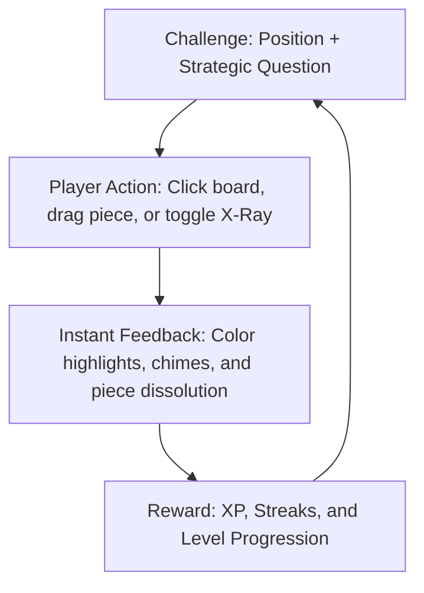

# Game Design Document: Chess X-Ray (Skeletal Trainer)

## 1. High-Level Concept

* **One-Sentence Hook**: A gamified chess trainer that transforms complex middle games into simplified "structural skeletons" by stripping away tactical clutter, teaching players to instinctively see pawn chains, weak squares, and strategic plans.
* **Core Loop**:

* **Target Emotion**: The intellectual "Aha!" moment of structural discovery—shifting the player's perception from a chaotic board of 32 pieces to a clean, readable map of pawn structures and open files.

---

## 2. Core Mechanics

### A. Player Actions
* **Interactive Clicking**: Clicking directly on board squares to identify positional targets (e.g., backward pawns, outpost holes, open files).
* **Interactive Pawn Push**: Dragging or double-clicking a pawn to propose the correct "pawn break" or "pawn lever" move.
* **X-Ray Filter Toggle**: A key button that the player can toggle at any time to activate the "Noise Filter".
  * When **ON**: Non-structural pieces (Queens, Rooks, Bishops, Knights) fade to $15\%$ opacity with a clean, vector-style "wireframe" outline, unless they are directly blockading or attacking a structural point.
  * Pawn chains, open files, and target weaknesses light up with vibrant, glowing CSS overlays.
* **Hints**: Clicking the "Get Visual Hint" button triggers a pulsing animation on the pawn chains or files related to the question, lowering the potential score for that puzzle but preventing frustration.

### B. Positional Indicators & Overlays (The X-Ray Layer)
When X-Ray Mode is active, the board renders custom visual overlays:
* **Pawn Chains**: Glowing color lines connecting pawns diagonally.
* **Open & Semi-Open Files**: Soft vertical blue neon tracks running up the file.
* **Weak Pawns (Isolated, Backward, Doubled)**: Glowing red/orange borders around the square.
* **Outpost Squares / Weak Holes**: Green pulsing target rings.
* **Pawn Levers**: Gold arrows showing the path of the pawn break (e.g., b4 ➔ b5).

### C. Victory & Failure Conditions
* **Victory Condition**: Correctly identifying the structural element or execution of the correct pawn break.
  * **Success**: Plays a high-pitched success chime, initiates a glowing ring animation from the target square, and displays an explanation card (e.g., *"Correct! The d6 pawn is backward because it cannot be defended by another pawn, and the e-file is blocked."*).
* **Failure Condition**: Selecting an incorrect square or incorrect pawn break.
  * **Penalty**: Plays a low-frequency failure tone, shakes the selected square, and provides a gentle guiding hint (e.g., *"Not quite. That pawn can still be defended by the c-pawn. Look for a pawn that has fallen behind."*). No hard limit on attempts, encouraging exploration and learning.

---

## 3. Progression & Level Structure

The game features a structured campaign consisting of **4 Core Syllabus Levels**, each teaching a fundamental pawn skeleton archetype, followed by an **Endless Blitz Mode**.

### Level 1: The Carlsbad Structure (Onboarding)
* **Target Concept**: Learn to recognize the Carlsbad pawn chain, identify the weak backward c-pawn, and execute the classic "Minority Attack".
* **Stage 1.1: Weakness Hunting**: Black has a backward pawn on c6. Player must click it.
* **Stage 1.2: The Outpost**: Player must identify the ideal green outpost square for White's knight (c5) versus Black's knight (e4).
* **Stage 1.3: The Lever**: Drag the White b-pawn to b5 to execute the minority attack.

### Level 2: The Isolated Queen's Pawn (IQP)
* **Target Concept**: Learn the dynamic nature of the IQP (d4/d5). Understand blockading squares and dynamic piece routing.
* **Stage 2.1: Target Practice**: Identify the isolated pawn on d4.
* **Stage 2.2: The Blockade**: Find the key blockading square directly in front of the IQP (d5).
* **Stage 2.3: Finding the Plan**: Select the correct plan (White: attack the kingside with pieces; Black: trade pieces and target the d4 weakness).

### Level 3: The Hedgehog Structure
* **Target Concept**: Understand Black's defensive spine (pawns on a6, b6, d6, e6) and the explosive counter-breaks.
* **Stage 3.1: Control Grid**: Highlight the squares controlled by Black's "spines" (a6-f6 range).
* **Stage 3.2: The Counter-Strike**: Identify the explosive pawn break (d6-d5 or b6-b5) that opens up the board for Black.

### Level 4: The Closed Center (King's Indian / French)
* **Target Concept**: Learn how locked centers dictate opposite-side attacks based on the direction the pawn chains point.
* **Stage 4.1: Vector Reading**: Click the side of the board where White's pawn chain points (Queenside) and Black's chain points (Kingside).
* **Stage 4.2: Double Levers**: Select the correct pawn storm levers (c4-c5 for White, f7-f5 for Black).

### Endless Mode: Blitz Skeletal Challenge
* **Description**: A timed, rapid-fire mode where positions are randomly pulled from master games. The player has $10$ seconds to classify the structure or click the primary weakness. Every correct answer adds $+2$ seconds to the timer.

---

## 4. "Juice" & Aesthetics

* **Theme**: Sleek, futuristic dark mode. A deep slate/navy background (`#0b0f19`) paired with semi-transparent glassmorphic panels and bright neon accents.
* **Visual Juice**:
  * **Wireframe Dissolve**: Non-structural pieces dynamically fade and morph into wireframes using SVG filter transitions when X-Ray is toggled.
  * **Skeletal Connections**: When selecting pawns, glowing green lines trace their connections back to the pawn chain root.
  * **Level Clear Confetti**: A radial burst of color-matching particles from the center of the board on level completion.
* **Sound Effects**:
  * **Toggles**: A mechanical "hologram boot-up" hum when X-Ray Mode is turned on.
  * **Success**: A clean, sparkling synth chime.
  * **Failure**: A soft, digital error click (not harsh or punishing).
