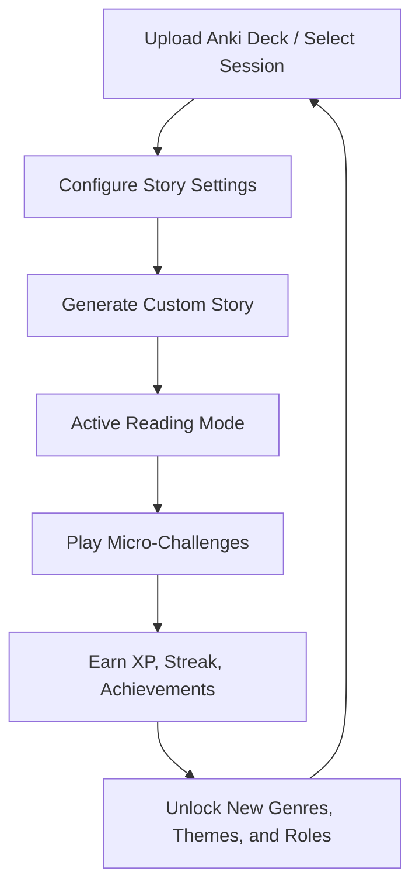

# Game Design Document: LingoQuest (Anki Story Adventure)

LingoQuest transforms the rote memorization of Anki flashcards into an immersive, gamified reading adventure. By generating context-aware stories based on active learning cards, LingoQuest helps players cross the bridge from simple vocabulary recall to native-like reading comprehension.

---

## 1. High-Level Concept

*   **One-Sentence Hook**: LingoQuest turns your active Anki learning decks into custom, interactive role-playing stories and challenges where vocabulary recall is your superpower.
*   **Target Emotion**: The "Aha!" moment of recognition when a word that was previously just an isolated flashcard fits perfectly into a living story context, yielding immediate comprehension.
*   **The Player Persona**: A language learner who feels burnt out by flashcard repetitions ("Anki fatigue") and wants to see their vocabulary progress translated directly into active reading and gameplay.

---

## 2. The Core Loops

LingoQuest features two nested engagement loops: the **Macro Progression Loop** and the **Micro Interaction Loop**.

### Macro Progression Loop (Session-Level)


### Micro Interaction Loop (Interaction-Level)
1.  **Challenge**: Player encounters an unknown or highlighted target vocabulary word embedded in the story text.
2.  **Action**: Player hovers over or clicks the word to check its definition and details.
3.  **Feedback**: A sleek glassmorphic card overlay slides into view, showing the word's card face details (translation, part of speech, or usage note).
4.  **Reward**: A small progress bar tracks "words encountered," contributing to the overall story completion bonus.

---

## 3. Core Mechanics

### A. Story Configuration (The Match Setup)
Before embarking on a Quest, the player configures their adventure settings:
*   **Genre Selection**: Sci-Fi, Fantasy, Noir Mystery, Daily Life (Default), or Cyberpunk.
*   **Difficulty Rating**: 
    *   *Novice*: Short sentences, simpler vocabulary structure, dual-language side-by-side reading.
    *   *Apprentice*: Moderate sentence structure, only target words highlighted, monolingual story.
    *   *Master*: Complex sentence structures, advanced syntax, vocabulary words are blanked out initially.
*   **Vocabulary Extraction**: The app parses the `.apkg` file, extracts 5 to 15 cards flagged as "learning" or "young" (interval < 21 days), and passes them to the generator.

### B. Active Reading Mode (The Campaign)
*   **Visual Board**: The story is rendered in clean, legible typography with custom paragraph styling.
*   **Target Highlights**: Target vocabulary words are highlighted with a distinct pulsing color theme.
*   **Interactive Overlays**: Clicking a highlighted word opens a springy preview card detailing the card's back side.
*   **The "Check" System**: Players can flag words as "Still Struggling" or "Mastered during this story" to influence future selection rates.

### C. The Micro-Challenges (The Battles)
Once the player finishes reading the story, they must complete three quick mini-games to locking in vocabulary recall:

#### Challenge 1: The Cloze Rift (Fill-in-the-Blanks)
*   **Objective**: Drag and drop the target vocabulary words back into their correct slots in the story paragraphs.
*   **Failure Condition**: Placing a word in the wrong slot snaps it back to the tray, playing a subtle error shake animation.
*   **Victory Condition**: All blank slots are filled correctly.

#### Challenge 2: Comprehension Quest (Lore Check)
*   **Objective**: Answer 3 reading comprehension questions generated by Gemini about the plot of the story in the target language (with optional translation hints).
*   **Interaction**: Multiple-choice format (A, B, C, D) using custom cards that highlight green/red upon selection.
*   **Reward**: Earn multiplier bonuses for perfect 3/3 answers.

#### Challenge 3: Speed Match (Time Trial)
*   **Objective**: Match 6 cards (front sides) to their corresponding 6 translations (back sides) scattered on a grid within 20 seconds.
*   **Feedback**: Correct matches trigger a particle burst and vanish; incorrect matches shake and flash red, adding a +1 second penalty.

---

## 4. Progression & Rewards (Player Leveling)

LingoQuest keeps players returning daily through structured progression indicators stored locally in the browser (`localStorage`):

### A. Experience Points (XP) & Levels
Players gain XP for every completed quest action:
*   **Story Completed (Read)**: +20 XP.
*   **Cloze Rift Solved**: +30 XP (+10 XP perfect bonus).
*   **Comprehension Quest Solved**: +10 XP per correct answer (+15 XP perfect 3/3 bonus).
*   **Speed Match Solved**: +20 XP (+10 XP under-ten-seconds speed bonus).

**Level-Up Formula**: 
$$\text{XP Required for Level } L = L \times 150 \text{ XP}$$
Reaching new levels unlocks custom content rewards to maintain interest.

### B. Daily Streaks & Milestones
*   **Daily Streak Count**: Tracks consecutive active days.
*   **Streak Multiplier**: A streak of 3+ days grants a +10% XP bonus on all activities.
*   **Streaks Saver**: Players can purchase a "Streak Freeze" using imaginary LingoCoins (earned via leveling up, no real money involved).

### C. Unlocks & Achievements
*   **Level 2 Unlock**: Fantasy and Noir Mystery genres.
*   **Level 3 Unlock**: Sci-Fi and Cyberpunk genres.
*   **Level 4 Unlock**: "Custom Prompts" - type your own custom story outline (e.g. "A detective investigating a stolen cheese slice in Paris").
*   **Achievements**:
    *   *Polyglot Padawan*: Complete your first story.
    *   *Lexical Sniper*: Solve Cloze Rift with 100% accuracy.
    *   *Time Bender*: Solve Speed Match in under 8 seconds.

---

## 5. Visual "Juice" & HSL Style Guide

To make interactions feel premium and highly responsive, the app employs micro-animations and a unified HSL design palette:

### HSL Color Tokens
*   **Dark Mode Background**: `hsl(224, 71%, 4%)` (Deep Space Blue)
*   **Card Background (Glassmorphism)**: `hsla(224, 71%, 8%, 0.7)` with `backdrop-filter: blur(12px)`
*   **Primary / Accent Light**: `hsl(190, 95%, 45%)` (Electric Cyan)
*   **Secondary / Highlight**: `hsl(265, 80%, 65%)` (Bright Purple)
*   **Success state**: `hsl(145, 80%, 40%)` (Emerald Green)
*   **Failure state**: `hsl(355, 80%, 55%)` (Coral Red)
*   **Text (Primary)**: `hsl(210, 40%, 98%)` (Crisp Off-White)

### The Juicing Checklist
*   **Hover States**: Buttons and cards scale up slightly (`transform: scale(1.03)`) with a smooth cubic-bezier transition (`transition: all 0.3s cubic-bezier(0.25, 0.8, 0.25, 1)`).
*   **Success Indicator**: Correct clicks trigger canvas confetti or localized green particle sprays.
*   **Error Shake**: Incorrect matches trigger a keyframe shake animation:
    ```css
    @keyframes shake {
      0%, 100% { transform: translateX(0); }
      25% { transform: translateX(-5px); }
      75% { transform: translateX(5px); }
    }
    ```
*   **Level Up Event**: A full-screen celebration modal with floating XP numbers, star particle bursts, and an overlay congratulating the player.

---

# Game Design Document: Smallest Step

## 1. High-Level Concept
- **One-Sentence Hook**: Smallest Step breaks massive, anxiety-inducing goals into a deeply visual, fading vertical timeline of ultra-small daily micro-tasks, acting as a dynamic assistant to keep you moving forward.
- **Core Loop**: Enter a large goal -> AI breaks it down into immediate micro-steps -> User completes step (with AI assistant help if needed) -> Next step is revealed on the timeline.
- **Target Emotion**: Relief from overwhelm; the satisfying, steady momentum of crossing off tiny, achievable tasks.

## 2. Core Mechanics
- **Player Actions**:
  - Input a massive goal (e.g., "Build a mobile app").
  - Click "Complete" on the current micro-step on the timeline.
  - Click "Help me execute" for the dynamic AI assistant to perform or guide the current micro-step (e.g., "Shall I search for prices?").
- **Victory Condition**: Completing the daily micro-step, maintaining the daily momentum streak, and eventually reaching the bottom of the timeline (the massive goal).
- **Failure Condition**: Breaking the daily streak by not completing the current micro-step, causing a loss of streak multiplier.

## 3. Progression & Level Structure
- **Level 1 (Onboarding)**: User inputs their first goal. The AI instantly generates just the first 3 micro-steps to prevent overwhelm. The very first step is intentionally trivial (e.g., "Create a folder on your computer").
- **Level 2 (Introduction of complexity)**: After a 3-day streak, the AI assistant introduces the "Help me execute" feature for slightly more complex steps (e.g., researching a topic).
- **Level 3 (The Test)**: The user encounters a "boss" step (a slightly larger task). The UI encourages them to use a "Break down further" button if they feel overwhelmed, turning the boss step into 3 more micro-steps.

## 4. "Juice" & Aesthetics
- **Visual Effects**:
  - A "fading future" vertical timeline UI, where upcoming steps are blurred/faded at the bottom of the screen to keep focus on the present.
  - A satisfying "check-off snap" animation when a step is completed, sliding the timeline up.
  - Streak/chart visualizations that glow more intensely as the streak increases.
- **Sound Effects**:
  - A crisp, satisfying 'click' or 'pop' when completing a step.
  - A rising, melodic chime when extending a multi-day streak.
