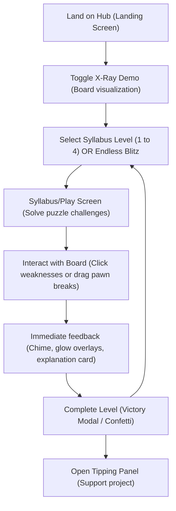

# UX Specification: Chess X-Ray (Skeletal Trainer)

This document serves as the **One-Shot Ready UX Specification** for the Chess X-Ray web application. It outlines the interface components, screen flows, state machine rules, HSL style guides, and offline puzzle data necessary for a single-pass implementation.

---

## 1. User Persona & Motivations

*   **Primary Persona**: Intermediate Club Player (1200–1600 Elo).
*   **Key Pain Point**: Struggles to identify long-term strategic plans and pawn skeletons behind a clutter of tactical pieces (Knights, Bishops, Rooks, Queens).
*   **Goal**: Train visual intuition to instantly recognize pawn chains, backward/isolated weaknesses, outposts, and pawn levers.
*   **FTUE (First Time User Experience)**: Within 3 seconds of landing, the player should see a beautiful, glowing chessboard showing Carlsbad pawn chain skeletons and a prominent "X-Ray Mode" toggle button ready to click.

---

## 2. User Journey & Core Flow



---

## 3. Screen Inventory & Layout Grids

The application consists of a single-page app (SPA) container `#app` divided into distinct views toggled by the active state.

```
+-------------------------------------------------------------+
|                      HEADER / NAV BAR                       |
|  [Logo] Chess X-Ray                       [Tips] [Stats]    |
+-------------------------------------------------------------+
|                                                             |
|   +-----------------------+     +-----------------------+   |
|   |                       |     |                       |   |
|   |                       |     |     PANEL / HUD       |   |
|   |                       |     |                       |   |
|   |      CHESSBOARD       |     |   [Title / Question]  |   |
|   |                       |     |                       |   |
|   |       CONTAINER       |     |   [Instructions]      |   |
|   |                       |     |                       |   |
|   |                       |     |   [Action Controls]   |   |
|   |                       |     |                       |   |
|   +-----------------------+     +-----------------------+   |
|                                                             |
+-------------------------------------------------------------+
|                        FOOTER / TABS                        |
+-------------------------------------------------------------+
```

### 3.1 Screen A: Landing Hub (`#landing-screen`)
*   **Layout Structure**: CSS Grid. Two columns on desktop (chessboard left, text/mode selection right); single column on mobile.
*   **Focal Point**: A pre-loaded, non-playable chessboard displaying the Carlsbad structure with the X-Ray Mode toggle flashing gently to encourage click.
*   **Elements**:
    *   `#hero-title`: "Chess X-Ray" with gradient text.
    *   `#hero-subtitle`: "Train your brain to filter tactical noise and see the structural skeleton of the middle game."
    *   `#syllabus-menu`: Grid of 4 Level Cards, each showing title, concept, and progress status.
    *   `#endless-start-btn`: A prominent primary action button to initiate Endless Blitz mode.

### 3.2 Screen B: Syllabus/Play Screen (`#play-screen`)
*   **Layout Structure**: CSS Flex/Grid. Centered layout with board on the left and instructions/progress cards on the right.
*   **Focal Point**: Interactive chessboard with neon highlights.
*   **Elements**:
    *   `#board-container`: A responsive square box containing the SVG/canvas chess grid.
    *   `#xray-toggle-btn`: A premium pills/pill-shaped button with a glowing background indicator.
    *   `#stage-hud`: Displays current level and stage (e.g., "Level 1.1: Carlsbad Outposts").
    *   `#strategic-question`: A clean, high-contrast text block presenting the active goal.
    *   `#feedback-panel`: A dynamic slide-up panel showing success descriptions or guidance hints.
    *   `#hint-btn`: Displays visual highlights at a score penalty.

### 3.3 Screen C: Endless Blitz Screen (`#blitz-screen`)
*   **Layout Structure**: Similar to Play Screen, optimized for rapid focus.
*   **Elements**:
    *   `#blitz-timer`: A circular countdown progress ring that changes color from Green (10s) to Orange (5s) to Red (3s).
    *   `#blitz-score`: Counters for Current Score, High Score, and Active Streak.
    *   `#blitz-question`: Single-sentence prompt (e.g., "Click the isolated pawn!").

### 3.4 Modal D: Level Victory (`#victory-modal`)
*   **Layout Structure**: Centered absolute glassmorphic panel overlaying the screen.
*   **Elements**:
    *   `#victory-title`: "Level Cleared!"
    *   `#victory-stats`: Shows accuracy percentage and time taken.
    *   `#next-level-btn`: Primary button to load the next syllabus module.
    *   `#confetti-canvas`: Canvas overlay running the particle burst animation.

### 3.5 Slide-out Panel E: Tipping & Ledger (`#tipping-panel`)
*   **Layout Structure**: Right-side drawer with slide-in transition.
*   **Elements**:
    *   `#tips-tabs`: Tabs for Ethereum (ETH), Harmony (ONE), and Buy Me A Coffee.
    *   `#address-copy-box`: Read-only text fields with associated copy-to-clipboard buttons.
    *   `#ledger-link`: Link to project ledger file for transparent verification.

---

## 4. State Machine & Logic

The application state is managed by a single state object.

### 4.1 State Variables
```javascript
const appState = {
  viewState: 'LANDING',          // 'LANDING' | 'SYLLABUS_PLAY' | 'BLITZ_PLAY' | 'LEVEL_COMPLETE'
  activeLevelId: null,           // 1 | 2 | 3 | 4
  activeStageIndex: 0,           // 0 | 1 | 2
  isXRayActive: true,            // Boolean
  hintUsed: false,               // Boolean
  
  // Endless Blitz Mode state
  blitzTimeRemaining: 10,        // Number (seconds)
  blitzScore: 0,                 // Number
  blitzStreak: 0,                // Number
  blitzActivePositionIndex: 0,   // Number
  
  // Selected / Interaction tracking
  selectedSquare: null,          // String (e.g., 'c6')
  completedStages: {},           // Map of levelId -> completedStageIndex
  answersLogged: []              // Array of user attempts for analysis
};
```

### 4.2 State Transition Matrix

| Current State | User Action | Next State | Side Effects |
| :--- | :--- | :--- | :--- |
| `LANDING` | Click Level Card (ID) | `SYLLABUS_PLAY` | Load level/stage config, Reset states |
| `LANDING` | Click "Endless Blitz" | `BLITZ_PLAY` | Initialize timer (10s), Reset score/streak, load random puzzle |
| `SYLLABUS_PLAY` | Solve Final Stage | `LEVEL_COMPLETE` | Mark level complete, Trigger victory chimes and particle burst |
| `SYLLABUS_PLAY` | Click "Exit to Hub" | `LANDING` | Save progress |
| `BLITZ_PLAY` | Timer hits 0 | `LEVEL_COMPLETE` | Record high score, open summary |
| `LEVEL_COMPLETE`| Click "Next Level" | `SYLLABUS_PLAY` | Increment Level, load Stage 1 |
| `LEVEL_COMPLETE`| Click "Back to Menu" | `LANDING` | Reset active states |

---

## 5. Aesthetics & HSL Style Guide

### 5.1 Color Tokens

All styling must use the following custom HSL values:

| Token Name | HSL Value | Hex Equivalent | Description |
| :--- | :--- | :--- | :--- |
| `--bg-base` | `hsl(222, 40%, 7%)` | `#0b0f19` | Main application background (dark slate) |
| `--panel-bg` | `hsla(222, 40%, 15%, 0.7)` | `#141b2d` | Glassmorphic cards background (70% opacity) |
| `--neon-green` | `hsl(145, 100%, 50%)` | `#00ff6c` | Outpost target rings, success states |
| `--neon-blue` | `hsl(200, 100%, 50%)` | `#00b0ff` | Open files, UI primary actions |
| `--neon-gold` | `hsl(45, 100%, 50%)` | `#ffd700` | Pawn breaks, path arrows |
| `--neon-orange`| `hsl(25, 100%, 50%)` | `#ff6c00` | Weak pawns, warning indicators |
| `--text-light` | `hsl(210, 40%, 98%)` | `#f8fafd` | Body headings and readable text |
| `--text-muted` | `hsl(215, 20%, 65%)` | `#93a1b8` | Subtext and inactive markers |

### 5.2 Micro-interactions & Juice
*   **Wireframe Dissolve Effect**:
    When X-Ray Mode is toggled to **ON**, non-structural pieces (Queens, Rooks, Bishops, Knights) transition to 15% opacity with a clean, CSS-based outline filter. Pawns, blockaders, and active pieces remain at 100% opacity.
    ```css
    .piece.non-structural {
      transition: opacity 0.4s cubic-bezier(0.4, 0, 0.2, 1), filter 0.4s;
    }
    .xray-active .piece.non-structural {
      opacity: 0.15;
      filter: drop-shadow(0 0 2px var(--neon-blue)) grayscale(100%);
    }
    ```
*   **Success Glow & Pulse**:
    Correctly answered squares scale up 10% and pulse with `--neon-green` shadow rings.
*   **Failure Shake**:
    Incorrect clicks apply a quick horizontal shake animation (`200ms` duration, 3 cycles).

---

## 6. Audio Synthesis Spec (Web Audio API)

To keep the application static and serverless with $0 external asset cost, sounds are dynamically generated using the **Web Audio API**:

*   **Success Chime**:
    *   Type: Triangle wave.
    *   Arpeggio: E5 ($659.25\text{ Hz}$ for $80\text{ ms}$) -> G5 ($783.99\text{ Hz}$ for $80\text{ ms}$) -> C6 ($1046.50\text{ Hz}$ for $200\text{ ms}$).
    *   Decay: Smooth gain ramp down to zero.
*   **Failure Click**:
    *   Type: Sine wave.
    *   Sound: $120\text{ Hz}$ frequency drop to $60\text{ Hz}$ within $100\text{ ms}$.
    *   Gain: Fast exponential decay.
*   **Hologram Boot hum**:
    *   Type: Sawtooth wave passed through a low-pass filter (cutoff $300\text{ Hz}$).
    *   Sound: $100\text{ Hz}$ pitch swept up to $150\text{ Hz}$ over $400\text{ ms}$ with a resonance peak.

---

## 7. Hardcoded Offline Mock Data

Below is the complete database of Syllabus Levels and Endless challenges:

### Level 1: The Carlsbad Structure (Onboarding)
*   **Target FEN**: `r1r3k1/1b1nbppp/1ppqp3/3p4/1P1P4/2N1PN2/2Q1BPPP/1RR3K1 w - - 0 1`
*   **Stages**:
    *   **Stage 1.1: Weakness Hunting**
        *   *Question*: "Black's b-pawn moved, leaving the c6-pawn backward and vulnerable. Click the backward pawn."
        *   *Correct Target*: `c6`
        *   *Success Text*: "Correct! The c6 pawn has fallen behind and can no longer be protected by another pawn."
    *   **Stage 1.2: The Outpost**
        *   *Question*: "Which square is a perfect outpost hole for White's Knight, immune to pawn attacks?"
        *   *Correct Target*: `c5`
        *   *Success Text*: "Perfect! The c5 square is blockaded by Black's pawns and acts as an unassailable home for White's pieces."
    *   **Stage 1.3: The Lever (Minority Attack)**
        *   *Question*: "Execute the minority attack. Push White's b-pawn forward to break open Black's chain."
        *   *Correct Move*: `b4-b5` (Move pawn from `b4` to `b5`)
        *   *Success Text*: "Brilliant! Pushing the b-pawn initiates a minority attack, intending to swap on c6 and isolate Black's pawn structure."

### Level 2: The Isolated Queen's Pawn (IQP)
*   **Target FEN**: `r1bq1rk1/pp2bppp/2n1pn2/3p4/3P4/2NB1N2/PP3PPP/R1BQ1RK1 w - - 0 1`
*   **Stages**:
    *   **Stage 2.1: Target Practice**
        *   *Question*: "Identify and click the isolated pawn on the board."
        *   *Correct Target*: `d4`
        *   *Success Text*: "Correct! White's d4 pawn has no adjacent pawns to support it, making it isolated."
    *   **Stage 2.2: The Blockade**
        *   *Question*: "Which square must Black control to block White's isolated pawn from advancing?"
        *   *Correct Target*: `d5`
        *   *Success Text*: "Excellent! The d5 square blockades the IQP, preventing it from advancing and opening up the files."
    *   **Stage 2.3: Finding the Plan**
        *   *Question*: "White's plan is dynamic kingside attack, Black's is trading pieces. What should White do?"
        *   *Options*:
            *   "Trade all minor pieces to reach an endgame"
            *   "(Correct) Shift pieces to the kingside and create attacking vectors"
            *   "Play passively and guard the d4 pawn"
        *   *Success Text*: "Spot on! The IQP grants White space and activity; trade favors the defender (Black)."

### Level 3: The Hedgehog Structure
*   **Target FEN**: `r1bq1rk1/1b2bppp/p2ppn2/1p6/3PP3/1PNB1N2/PB2QPPP/2R2RK1 w - - 0 1`
*   **Stages**:
    *   **Stage 3.1: Control Grid**
        *   *Question*: "The Hedgehog spines control the 5th rank. Click Black's key pawn defending the center."
        *   *Correct Target*: `d6` (or `e6`)
        *   *Success Text*: "Yes! The pawns on d6 and e6 act as defensive spines, stopping White's central expansions."
    *   **Stage 3.2: The Counter-Strike**
        *   *Question*: "Identify the square where Black targets their explosive center break."
        *   *Correct Target*: `d5`
        *   *Success Text*: "Brilliant! The d5 push is the critical counter-strike that dismantles White's center."

### Level 4: The Closed Center (French Defense)
*   **Target FEN**: `r1bqk2r/pp2bppp/2n1p3/3pP3/3P4/5N2/PP3PPP/RNBQKB1R w KQkq - 0 1`
*   **Stages**:
    *   **Stage 4.1: Vector Reading**
        *   *Question*: "Click the side of the board where White's pawn chain (d4-e5) directs White's attack."
        *   *Correct Target*: `f7` (or any square in the `e7/f7/g7/h7` kingside sector)
        *   *Success Text*: "Correct! White's pawn chain points to the kingside, indicating attacking potential there."
    *   **Stage 4.2: Double Levers**
        *   *Question*: "Click the square where Black should strike white's center with a pawn lever."
        *   *Correct Target*: `c5`
        *   *Success Text*: "Brilliant! The c5 break strikes the base of White's d4-e5 pawn chain."

### Endless Blitz Challenge Positions
A rotating deck of positions:
1.  **Position A** (FEN: `r1bqkb1r/ppp2ppp/2n1p3/3p4/3Pn3/2PBPN2/PP3PPP/RNBQK2R w KQkq - 3 6`)
    *   *Question*: "Click Black's active outpost piece blockading White's pawn expansion."
    *   *Target*: `e4`
2.  **Position B** (FEN: `rnbqkb1r/pp2pppp/2p2n2/3p4/2PP4/2N5/PP2PPPP/R1BQKBNR w KQkq - 2 4`)
    *   *Question*: "Click the pawn which White will challenge with a cxd5 exchange."
    *   *Target*: `d5`
3.  **Position C** (FEN: `r1bqk2r/ppp1bppp/2n1pn2/3p4/3P4/2N2NP1/PPP1PPBP/R1BQK2R w KQkq - 3 6`)
    *   *Question*: "Identify the isolated Queen's pawn."
    *   *Target*: `d4`
