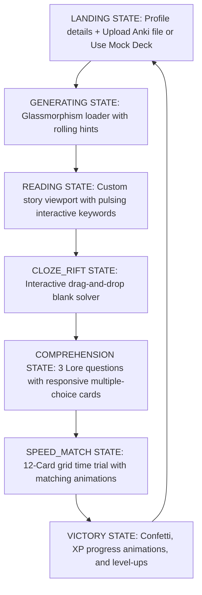
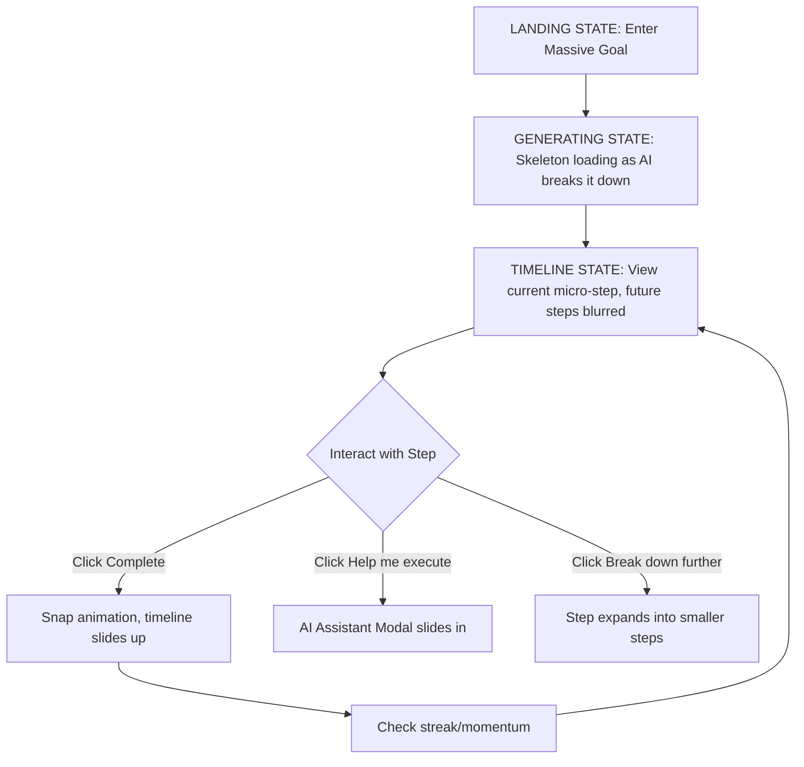

# UX Specification: LingoQuest (Anki Story Adventure)

This specification defines the complete user experience, screen inventory, component structure, interactive state machine, and styling guides for LingoQuest. It is designed to be **One-Shot Ready**, allowing subsequent engineering agents to implement the application without ambiguity.

---

## 1. User Persona & Motivations

* **Primary Persona**: Casual-to-Intermediate Language Learner (e.g., learning Spanish or Japanese) who has developed "Anki Fatigue."
* **Key Pain Point**: Rote flashcard reviews feel like a chore; the user can recall a card in isolation but struggles to recognize and comprehend the word in fluid, native context.
* **Core Goal**: Bridge the gap between rote memorization and active comprehension by reading stories featuring their real learning words, and validating that recall through engaging micro-challenges.
* **The 3-Second Test**: Within 3 seconds of loading, the page displays a header reading **LingoQuest**, a profile bar showing their Level, XP, and Streak, and an absolute central card with a file input: "Upload Anki Deck to Begin Your Quest."

---

## 2. User Journey & Core Flow



---

## 3. State Machine & Client-Side Variables

The application is run as a single-page app (SPA) driven by a central reactive state machine.

### Central State Variables (`localStorage` backed for persistence)

* `userLevel` (integer, default: `1`)
* `userXP` (integer, default: `0`)
* `userCoins` (integer, default: `0`)
* `streakCount` (integer, default: `0`)
* `lastActiveDate` (string, ISO YYYY-MM-DD or `null`)

### Session State Variables

* `gameState` (enum: `LANDING`, `LOADING_STORY`, `READING_STORY`, `CHALLENGE_CLOZE`, `CHALLENGE_COMPREHENSION`, `CHALLENGE_SPEED_MATCH`, `VICTORY`)
* `selectedGenre` (enum: `Daily Life` (default), `Sci-Fi`, `Fantasy`, `Noir Mystery`, `Cyberpunk`)
* `selectedDifficulty` (enum: `Novice`, `Apprentice`, `Master`)
* `vocabularyList` (array of objects: `{ front: string, back: string, id: string, status: 'learning'|'mastered' }`)
* `storyText` (string)
* `storyParagraphs` (array of strings, split for rendering)
* `comprehensionQuestions` (array of objects: `{ question: string, options: string[], answer: string, explanation: string, selectedIndex: null|number, isCorrect: null|boolean }`)
* `speedMatchCards` (array of objects: `{ id: string, text: string, type: 'front'|'back', matched: boolean, selected: boolean }`)

### Transition Rules

1. `LANDING` $\rightarrow$ click **Upload** or **Use Demo Deck** $\rightarrow$ `LOADING_STORY`
2. `LOADING_STORY` $\rightarrow$ server response $\rightarrow$ `READING_STORY`
3. `READING_STORY` $\rightarrow$ click **Begin Challenges** $\rightarrow$ `CHALLENGE_CLOZE`
4. `CHALLENGE_CLOZE` $\rightarrow$ all blanks solved $\rightarrow$ `CHALLENGE_COMPREHENSION`
5. `CHALLENGE_COMPREHENSION` $\rightarrow$ click **Proceed** (after 3 questions answered) $\rightarrow$ `CHALLENGE_SPEED_MATCH`
6. `CHALLENGE_SPEED_MATCH` $\rightarrow$ all 6 pairs matched $\rightarrow$ `VICTORY`
7. `VICTORY` $\rightarrow$ click **New Quest** $\rightarrow$ `LANDING`

---

## 4. Screen Specifications & Layout Skeletons

All views reside inside a main container:

```html
<div class="app-container">
  <!-- Dynamic screens are injected/toggled here -->
</div>
```

### Screen A: Landing Screen (`LANDING` state)

* **Focal Point**: A glowing glassmorphic layout holding the drag-and-drop file upload target.
* **Top Bar (Header)**:
  * Left side: "LingoQuest" title in custom font (Outfit/Inter) with Electric Cyan text gradient.
  * Right side: User Profile Badge showing `Level [X]` and `[XP / TargetXP] XP` as a sleek horizontal progress bar. Streak badge displaying a flaming icon and `[StreakCount] Days`.
* **Middle Layout**: Two-column flex container.
  * **Left Column (Settings Panel)**:
    * *Genre Select*: Interactive card grid (Daily Life, Sci-Fi, Fantasy, Noir, Cyberpunk). Locked genres (Sci-Fi, Noir etc. based on player level) are grayed out with a padlock icon and "Unlock at Level [X]".
    * *Difficulty Select*: Slider or segmented control button group (Novice, Apprentice, Master). Novice lists "Side-by-side translation"; Master lists "Cloze-initially".
  * **Right Column (File Dropzone)**:
    * An active dotted border area with hover scaling. Message: "Drop your `.apkg` file here, or click to browse."
    * *Secondary CTA*: "Or, play with our Mock Japanese/Spanish Demo Deck" for immediate value entry.
* **Aesthetics & Micro-interactions**: Hovering over genres triggers scale transitions (`scale(1.02)`) and light purple box-shadow glows.

### Screen B: Loading Screen (`LOADING_STORY` state)

* **Focal Point**: An animated compass or spinning rune at the center.
* **Layout**: Column layout centered in the screen.
  * A massive pulsing cyan circular loader.
  * Progress label: "Gemini is weaving your Noir Mystery story..."
  * A rotating carousel of helpful learning tips (e.g., "Tip: Hovering over highlighted words in the story shows their definitions!").

### Screen C: Story Viewport (`READING_STORY` state)

* **Layout**: Centered narrow column (max-width `720px`) for optimal readability.
  * **Top Info Bar**: Displays "Quest Chapter: [Selected Genre] | Difficulty: [Difficulty]".
  * **Story Body**: Renders story paragraphs in larger, readable font (`1.2rem`, line-height `1.8`).
    * Vocabulary words are wrapped in `<span class="vocab-word" data-word-id="[id]">[word]</span>`.
    * Pulsing border/background on vocabulary words.
  * **Floating Definition Card (Modal/Overlay)**:
    * Triggered on click/tap of a `.vocab-word`.
    * A springy, small glassmorphic modal popping up near the pointer or anchored at the bottom right.
    * Shows: **Word (Front)**, **Translation (Back)**, and checkboxes to flag as "Mastered" or "Still Struggling".
  * **Bottom Action Bar**:
    * A prominent primary button at the bottom: "Complete Reading & Enter the Rift (+20 XP)". Disabled until user scrolls to the bottom of the story text.

### Screen D: Challenge 1 - The Cloze Rift (`CHALLENGE_CLOZE` state)

* **Focal Point**: The story text from Screen C, now with target vocabulary words replaced by empty dotted drop-zones (`<div class="drop-zone" data-word-id="[id]"></div>`).
* **Layout**:
  * *Top Bar*: "Challenge 1/3: The Cloze Rift. Drag words back into the text!"
  * *Text Area*: The story paragraphs with blank spots.
  * *Tray Panel (Bottom)*: A horizontal container holding the vocabulary words as draggable pill-shaped elements (`<div class="drag-pill" draggable="true" data-word-id="[id]">[front]</div>`).
* **Mechanics & Transitions**:
  * Dragging a pill over a drop-zone highlights it.
  * If correct: Pill snaps into place, flashes green, and locks.
  * If incorrect: Pill snaps back to the tray, plays a keyframe shake animation on both the pill and drop-zone, and triggers a brief red flash.

### Screen E: Challenge 2 - Comprehension Quest (`CHALLENGE_COMPREHENSION` state)

* **Focal Point**: A large question card at the center.
* **Layout**:
  * *Top Bar*: "Challenge 2/3: Comprehension Quest. Check your story details."
  * *Question Box*: Renders the current multiple-choice question.
  * *Options Grid*: 4 large glassmorphic cards (A, B, C, D) stacked vertically or in a 2x2 grid.
  * *Bottom Bar*: Progression dots (3 dots for the 3 questions) and a "Next Question" button (disabled until an option is chosen).
* **Mechanics**:
  * Clicking an option immediately reveals if it's correct (turns option green) or incorrect (chosen turns red, correct turns green).
  * An explanation block slides down at the bottom explaining the answer.

### Screen F: Challenge 3 - Speed Match (`CHALLENGE_SPEED_MATCH` state)

* **Focal Point**: A grid of 12 card elements (6 fronts, 6 backs) scrambled randomly.
* **Layout**:
  * *Top Info*: "Challenge 3/3: Speed Match. Link the pairs before time runs out!"
  * *Timer Bar*: A horizontal cyan bar shrinking from 100% to 0% representing 20 seconds.
  * *Card Grid*: A 3x4 responsive grid of cards.
* **Mechanics**:
  * Selecting a card gives it a purple border glow.
  * Selecting a second card checks for a match.
  * If correct: Both cards dissolve with a particle spray/opacity transition and disappear from grid.
  * If incorrect: Both cards flash red, shake, and unselect. Adds +1.5 seconds penalty to the elapsed time.
  * If timer runs out: A "Retry Speed Match" card overlay slides down (no XP penalty, just restart the trial).

### Screen G: Victory & Rewards Screen (`VICTORY` state)

* **Focal Point**: A spinning reward chest or circular level-up seal.
* **Layout**: Centered vertical board.
  * Header: "QUEST COMPLETE!" in gold/purple gradient text.
  * **XP Breakdown Summary Table**:
    * Story Read: `+20 XP`
    * Rift Solved: `+30 XP`
    * Comprehension Bonus: `+30 XP`
    * Speed Match Solved: `+20 XP`
    * *Total Earned*: `+100 XP`
  * **XP Progress Ring/Bar**: A massive circular ring showing the XP bar filling up. If user levels up, a "LEVEL UP!" banner bursts onto screen with particle/confetti effects.
  * **LingoCoins & Streaks**: Showing Coins added (`+10 Coins`) and streak updated (`3 Day Streak!`).
  * **Actions**:
    * "Return to Tavern (Landing Page)" - primary CTA button.

---

## 5. Aesthetics & Styling Guide (HSL)

### Palette Variables

```css
:root {
  --bg-deep-space: hsl(224, 71%, 4%);
  --bg-glass-card: hsla(224, 71%, 8%, 0.7);
  --border-glass: hsla(210, 40%, 98%, 0.12);
  
  --accent-cyan: hsl(190, 95%, 45%);
  --accent-cyan-glow: hsla(190, 95%, 45%, 0.3);
  
  --accent-purple: hsl(265, 80%, 65%);
  --accent-purple-glow: hsla(265, 80%, 65%, 0.3);
  
  --state-success: hsl(145, 80%, 40%);
  --state-failure: hsl(355, 80%, 55%);
  
  --text-primary: hsl(210, 40%, 98%);
  --text-muted: hsl(215, 20%, 65%);
}
```

### Visual Specifications

1. **Glassmorphism Cards**:
    * `background: var(--bg-glass-card);`
    * `backdrop-filter: blur(12px);`
    * `border: 1px solid var(--border-glass);`
    * `box-shadow: 0 8px 32px 0 rgba(0, 0, 0, 0.37);`
2. **Transitions & Easing**:
    * Use smooth springy transition for scales: `transition: transform 0.4s cubic-bezier(0.175, 0.885, 0.32, 1.275), box-shadow 0.3s ease;`
3. **Active Story Word Highlights**:
    * `border-bottom: 2px dashed var(--accent-cyan);`
    * `background-color: var(--accent-cyan-glow);`
    * `cursor: pointer;`
    * `padding: 2px 6px;`
    * `border-radius: 4px;`
    * `animation: pulseGlow 2s infinite alternate;`

---

### 6. Mock Data & Assets (Offline Testing)

To support instant demo playing and testing when an Anki deck is not uploaded, the application contains this embedded mock data set.

### Spanish Demo Deck

```json
[
  { "id": "sp1", "front": "el ferrocarril", "back": "the railway / railroad" },
  { "id": "sp2", "front": "susurrar", "back": "to whisper" },
  { "id": "sp3", "front": "sombrío", "back": "gloomy / dark" },
  { "id": "sp4", "front": "el relámpago", "back": "the lightning" },
  { "id": "sp5", "front": "evitar", "back": "to avoid" },
  { "id": "sp6", "front": "esconder", "back": "to hide" }
]
```

### Mock Story (Spanish Noir Mystery)

"La noche era **sombría** y fría. Caminaba cerca del viejo **ferrocarril** abandonado para **evitar** a los guardias. De repente, un **relámpago** iluminó el cielo oscuro, revelando una silueta. Escuché a alguien **susurrar** mi nombre desde las sombras. Corrí a **esconder** el maletín antes de que fuera tarde."

### Mock Comprehension Questions

1. **¿Dónde caminaba el protagonista?**
    * A) En una playa soleada.
    * B) Cerca del ferrocarril abandonado. (Correct)
    * C) En una biblioteca municipal.
    * D) En el tejado de un hotel.
2. **¿Qué causó la iluminación repentina del cielo?**
    * A) Un relámpago. (Correct)
    * B) Los faros de un coche.
    * C) Un fuego artificial.
    * D) Un foco de los guardias.
3. **¿Qué acción realizó el protagonista al escuchar el susurro?**
    * A) Empezó a gritar de miedo.
    * B) Llamó a la policía local.
    * C) Escondió el maletín. (Correct)
    * D) Encendió una cerilla.

---

## UX Specification: Smallest Step

This specification defines the complete user experience, screen inventory, component structure, interactive state machine, and styling guides for Smallest Step. It is designed to be **One-Shot Ready**, allowing subsequent engineering agents to implement the application without ambiguity.

### 1. User Persona & Motivations

* **Primary Persona**: Overwhelmed individual (could be a student, professional, or hobbyist) struggling to start or maintain progress on a large, daunting project.
* **Key Pain Point**: Large goals induce "analysis paralysis" and anxiety, leading to procrastination.
* **Goal**: Break down massive goals into ultra-small, non-intimidating micro-steps to build momentum and consistency.
* **The 3-Second Test**: Within 3 seconds of loading, the user sees a calm, minimalist interface with a prominent input field asking: "What's a massive goal you're avoiding right now?" No clutter, no complex settings.

### 2. User Journey & Core Flow



### 3. State Machine & Client-Side Variables

#### Central State Variables (`localStorage` backed for persistence)

* `currentGoal` (string, the massive goal)
* `microSteps` (array of objects: `{ id: string, title: string, status: 'pending'|'completed', type: 'trivial'|'complex'|'boss' }`)
* `currentStepIndex` (integer)
* `streakCount` (integer, default: `0`)
* `lastActiveDate` (string, ISO YYYY-MM-DD or `null`)
* `userLevel` (integer, default: `1`)

#### Session State Variables

* `appState` (enum: `LANDING`, `LOADING_STEPS`, `TIMELINE_VIEW`, `ASSISTANT_ACTIVE`)
* `assistantChatHistory` (array of strings, for the active session)

#### Transition Rules

1. `LANDING` $\rightarrow$ Submit Goal $\rightarrow$ `LOADING_STEPS`
2. `LOADING_STEPS` $\rightarrow$ Steps generated $\rightarrow$ `TIMELINE_VIEW`
3. `TIMELINE_VIEW` $\rightarrow$ Click **Complete** on step $\rightarrow$ Update `streakCount`, increment `currentStepIndex` $\rightarrow$ `TIMELINE_VIEW`
4. `TIMELINE_VIEW` $\rightarrow$ Click **Help me execute** $\rightarrow$ `ASSISTANT_ACTIVE`
5. `ASSISTANT_ACTIVE` $\rightarrow$ Close Assistant / Task done $\rightarrow$ `TIMELINE_VIEW`

### 4. Screen Specifications & Layout Skeletons

#### Screen A: Landing Screen (`LANDING` state)

* **Focal Point**: A large, clean, minimalist text input field centered on the screen.
* **Layout**:
  * Center: "What's a massive goal you're avoiding right now?" (Large, calming font).
  * Input field underneath: Placeholder "e.g., Build a mobile app".
  * Submit button: Subtle, only appears when text is entered.
* **Aesthetics & Micro-interactions**: Input field focuses on load. Typing feels responsive.

#### Screen B: Loading / Generating (`LOADING_STEPS` state)

* **Focal Point**: Skeleton UI resembling a timeline slowly fading in.
* **Layout**:
  * Center: "Breaking that down into manageable pieces..."
  * A vertical line with pulsing skeleton nodes appearing one by one.

#### Screen C: Timeline View (`TIMELINE_VIEW` state)

* **Focal Point**: The single, immediate next micro-step in the center of the vertical timeline.
* **Layout**:
  * **Top Bar**: Minimalist header showing `[Goal Name]` and a glowing `[Streak] Days` counter.
  * **Main Timeline**: A vertical track.
    * *Completed Steps (Top)*: Small, grayed-out dots or faint text scrolling upwards and out of view.
    * *Current Step (Center)*: Large, fully opaque card. Contains the step title (e.g., "Create a project folder").
    * *Future Steps (Bottom)*: Visible but heavily blurred (`filter: blur(4px)`) and reduced opacity.
  * **Current Step Actions**:
    * **Primary Button**: "Complete" (Large, satisfying target).
    * **Secondary Button**: "Help me execute" (Appears based on user level/step complexity).
    * **Tertiary Action**: "Break down further" (Subtle text link).
* **Mechanics & Transitions**:
  * Clicking "Complete": A crisp 'pop' sound plays. The card visually checks off, scales down slightly, and slides up along the timeline, bringing the next blurred step into focus (unblurring it).

#### Screen D: AI Assistant (`ASSISTANT_ACTIVE` state)

* **Focal Point**: A chat-like interface sliding in from the right or bottom.
* **Layout**:
  * Header: "Assistant: [Current Step Title]"
  * Chat area: Shows AI context ("I see you need to research frameworks. Shall I search for React Native vs Flutter?").
  * Action buttons: E.g., "Yes, search", "Show me a tutorial", or text input for questions.
  * "Close & Return" button.

### 5. Aesthetics & Styling Guide (HSL)

#### Palette Variables

```css
:root {
  --bg-calm-light: hsl(210, 20%, 98%);
  --bg-calm-dark: hsl(210, 20%, 12%);
  --text-main: hsl(210, 20%, 20%);
  --text-muted: hsl(210, 10%, 60%);

  --accent-streak: hsl(30, 90%, 55%); /* Warm orange for streak flame */
  --accent-complete: hsl(150, 60%, 45%); /* Calming green */
  --timeline-line: hsl(210, 15%, 85%);

  --shadow-soft: 0 4px 20px rgba(0,0,0,0.05);
}
```

#### Visual Specifications

* **Theme**: Light, airy, minimalist. "Fading future" effect heavily relies on CSS blur and opacity gradients.
* **Typography**: Clean sans-serif (e.g., Inter or Roboto).
* **The "Snap" Animation**:

  ```css
  @keyframes completeSnap {
    0% { transform: scale(1); }
    50% { transform: scale(0.95); opacity: 0.8; }
    100% { transform: scale(1) translateY(-100%); opacity: 0; }
  }
  ```

### 6. Mock Data & Assets (Offline Testing)

#### Mock Goal & Steps

```json
{
  "goal": "Build a mobile app",
  "steps": [
    { "id": "s1", "title": "Create a new folder on your desktop named 'App_Project'", "status": "pending", "type": "trivial" },
    { "id": "s2", "title": "Open your browser and search for 'React Native vs Flutter'", "status": "pending", "type": "complex" },
    { "id": "s3", "title": "Read one article comparing the two frameworks", "status": "pending", "type": "boss" },
    { "id": "s4", "title": "Download and install Node.js (if not already installed)", "status": "pending", "type": "complex" }
  ]
}
```
