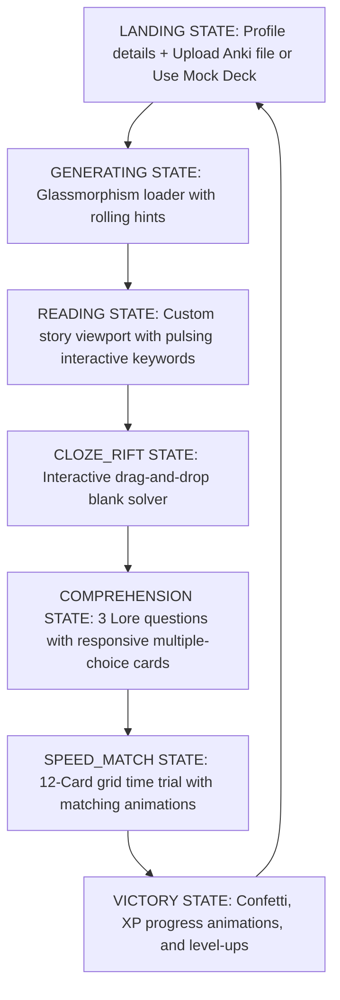
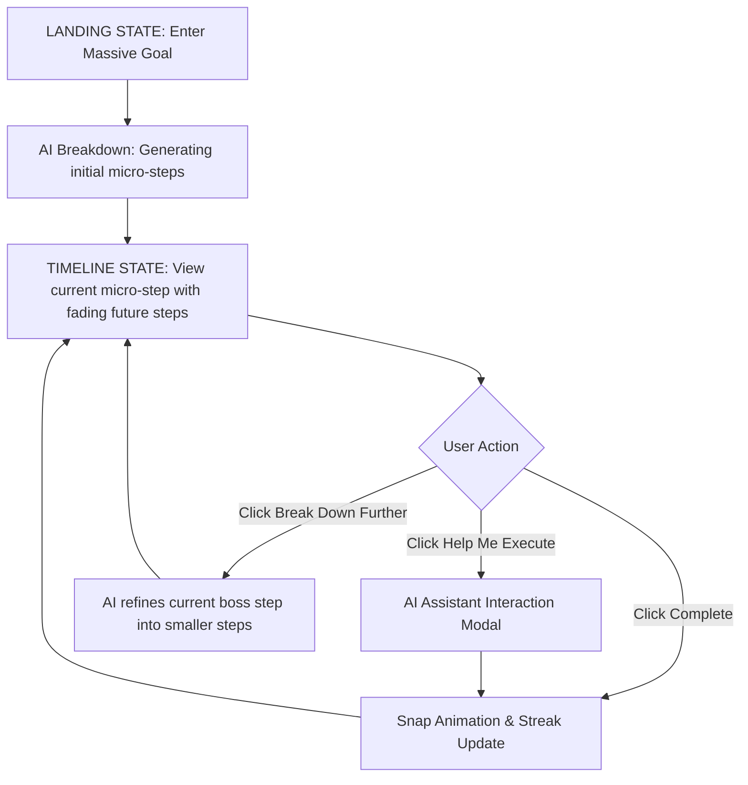

# UX Specification: LingoQuest (Anki Story Adventure)

This specification defines the complete user experience, screen inventory, component structure, interactive state machine, and styling guides for LingoQuest. It is designed to be **One-Shot Ready**, allowing subsequent engineering agents to implement the application without ambiguity.

---

## 1. User Persona & Motivations

*   **Primary Persona**: Casual-to-Intermediate Language Learner (e.g., learning Spanish or Japanese) who has developed "Anki Fatigue."
*   **Key Pain Point**: Rote flashcard reviews feel like a chore; the user can recall a card in isolation but struggles to recognize and comprehend the word in fluid, native context.
*   **Core Goal**: Bridge the gap between rote memorization and active comprehension by reading stories featuring their real learning words, and validating that recall through engaging micro-challenges.
*   **The 3-Second Test**: Within 3 seconds of loading, the page displays a header reading **LingoQuest**, a profile bar showing their Level, XP, and Streak, and an absolute central card with a file input: "Upload Anki Deck to Begin Your Quest."

---

## 2. User Journey & Core Flow



---

## 3. State Machine & Client-Side Variables

The application is run as a single-page app (SPA) driven by a central reactive state machine.

### Central State Variables (`localStorage` backed for persistence)

*   `userLevel` (integer, default: `1`)
*   `userXP` (integer, default: `0`)
*   `userCoins` (integer, default: `0`)
*   `streakCount` (integer, default: `0`)
*   `lastActiveDate` (string, ISO YYYY-MM-DD or `null`)

### Session State Variables

*   `gameState` (enum: `LANDING`, `LOADING_STORY`, `READING_STORY`, `CHALLENGE_CLOZE`, `CHALLENGE_COMPREHENSION`, `CHALLENGE_SPEED_MATCH`, `VICTORY`)
*   `selectedGenre` (enum: `Daily Life` (default), `Sci-Fi`, `Fantasy`, `Noir Mystery`, `Cyberpunk`)
*   `selectedDifficulty` (enum: `Novice`, `Apprentice`, `Master`)
*   `vocabularyList` (array of objects: `{ front: string, back: string, id: string, status: 'learning'|'mastered' }`)
*   `storyText` (string)
*   `storyParagraphs` (array of strings, split for rendering)
*   `comprehensionQuestions` (array of objects: `{ question: string, options: string[], answer: string, explanation: string, selectedIndex: null|number, isCorrect: null|boolean }`)
*   `speedMatchCards` (array of objects: `{ id: string, text: string, type: 'front'|'back', matched: boolean, selected: boolean }`)

### Transition Rules

1.  `LANDING` $\rightarrow$ click **Upload** or **Use Demo Deck** $\rightarrow$ `LOADING_STORY`
2.  `LOADING_STORY` $\rightarrow$ server response $\rightarrow$ `READING_STORY`
3.  `READING_STORY` $\rightarrow$ click **Begin Challenges** $\rightarrow$ `CHALLENGE_CLOZE`
4.  `CHALLENGE_CLOZE` $\rightarrow$ all blanks solved $\rightarrow$ `CHALLENGE_COMPREHENSION`
5.  `CHALLENGE_COMPREHENSION` $\rightarrow$ click **Proceed** (after 3 questions answered) $\rightarrow$ `CHALLENGE_SPEED_MATCH`
6.  `CHALLENGE_SPEED_MATCH` $\rightarrow$ all 6 pairs matched $\rightarrow$ `VICTORY`
7.  `VICTORY` $\rightarrow$ click **New Quest** $\rightarrow$ `LANDING`

---

## 4. Screen Specifications & Layout Skeletons

All views reside inside a main container:
```html
<div class="app-container">
  <!-- Dynamic screens are injected/toggled here -->
</div>
```

### Screen A: Landing Screen (`LANDING` state)

*   **Focal Point**: A glowing glassmorphic layout holding the drag-and-drop file upload target.
*   **Top Bar (Header)**:
    *   Left side: "LingoQuest" title in custom font (Outfit/Inter) with Electric Cyan text gradient.
    *   Right side: User Profile Badge showing `Level [X]` and `[XP / TargetXP] XP` as a sleek horizontal progress bar. Streak badge displaying a flaming icon and `[StreakCount] Days`.
*   **Middle Layout**: Two-column flex container.
    *   **Left Column (Settings Panel)**:
        *   *Genre Select*: Interactive card grid (Daily Life, Sci-Fi, Fantasy, Noir, Cyberpunk). Locked genres (Sci-Fi, Noir etc. based on player level) are grayed out with a padlock icon and "Unlock at Level [X]".
        *   *Difficulty Select*: Slider or segmented control button group (Novice, Apprentice, Master). Novice lists "Side-by-side translation"; Master lists "Cloze-initially".
    *   **Right Column (File Dropzone)**:
        *   An active dotted border area with hover scaling. Message: "Drop your `.apkg` file here, or click to browse."
        *   *Secondary CTA*: "Or, play with our Mock Japanese/Spanish Demo Deck" for immediate value entry.
*   **Aesthetics & Micro-interactions**: Hovering over genres triggers scale transitions (`scale(1.02)`) and light purple box-shadow glows.

### Screen B: Loading Screen (`LOADING_STORY` state)

*   **Focal Point**: An animated compass or spinning rune at the center.
*   **Layout**: Column layout centered in the screen.
    *   A massive pulsing cyan circular loader.
    *   Progress label: "Gemini is weaving your Noir Mystery story..."
    *   A rotating carousel of helpful learning tips (e.g., "Tip: Hovering over highlighted words in the story shows their definitions!").

### Screen C: Story Viewport (`READING_STORY` state)

*   **Layout**: Centered narrow column (max-width `720px`) for optimal readability.
    *   **Top Info Bar**: Displays "Quest Chapter: [Selected Genre] | Difficulty: [Difficulty]".
    *   **Story Body**: Renders story paragraphs in larger, readable font (`1.2rem`, line-height `1.8`).
        *   Vocabulary words are wrapped in `<span class="vocab-word" data-word-id="[id]">[word]</span>`.
        *   Pulsing border/background on vocabulary words.
    *   **Floating Definition Card (Modal/Overlay)**:
        *   Triggered on click/tap of a `.vocab-word`.
        *   A springy, small glassmorphic modal popping up near the pointer or anchored at the bottom right.
        *   Shows: **Word (Front)**, **Translation (Back)**, and checkboxes to flag as "Mastered" or "Still Struggling".
    *   **Bottom Action Bar**:
        *   A prominent primary button at the bottom: "Complete Reading & Enter the Rift (+20 XP)". Disabled until user scrolls to the bottom of the story text.

### Screen D: Challenge 1 - The Cloze Rift (`CHALLENGE_CLOZE` state)

*   **Focal Point**: The story text from Screen C, now with target vocabulary words replaced by empty dotted drop-zones (`<div class="drop-zone" data-word-id="[id]"></div>`).
*   **Layout**:
    *   *Top Bar*: "Challenge 1/3: The Cloze Rift. Drag words back into the text!"
    *   *Text Area*: The story paragraphs with blank spots.
    *   *Tray Panel (Bottom)*: A horizontal container holding the vocabulary words as draggable pill-shaped elements (`<div class="drag-pill" draggable="true" data-word-id="[id]">[front]</div>`).
*   **Mechanics & Transitions**:
    *   Dragging a pill over a drop-zone highlights it.
    *   If correct: Pill snaps into place, flashes green, and locks.
    *   If incorrect: Pill snaps back to the tray, plays a keyframe shake animation on both the pill and drop-zone, and triggers a brief red flash.

### Screen E: Challenge 2 - Comprehension Quest (`CHALLENGE_COMPREHENSION` state)

*   **Focal Point**: A large question card at the center.
*   **Layout**:
    *   *Top Bar*: "Challenge 2/3: Comprehension Quest. Check your story details."
    *   *Question Box*: Renders the current multiple-choice question.
    *   *Options Grid*: 4 large glassmorphic cards (A, B, C, D) stacked vertically or in a 2x2 grid.
    *   *Bottom Bar*: Progression dots (3 dots for the 3 questions) and a "Next Question" button (disabled until an option is chosen).
*   **Mechanics**:
    *   Clicking an option immediately reveals if it's correct (turns option green) or incorrect (chosen turns red, correct turns green).
    *   An explanation block slides down at the bottom explaining the answer.

### Screen F: Challenge 3 - Speed Match (`CHALLENGE_SPEED_MATCH` state)

*   **Focal Point**: A grid of 12 card elements (6 fronts, 6 backs) scrambled randomly.
*   **Layout**:
    *   *Top Info*: "Challenge 3/3: Speed Match. Link the pairs before time runs out!"
    *   *Timer Bar*: A horizontal cyan bar shrinking from 100% to 0% representing 20 seconds.
    *   *Card Grid*: A 3x4 responsive grid of cards.
*   **Mechanics**:
    *   Selecting a card gives it a purple border glow.
    *   Selecting a second card checks for a match.
    *   If correct: Both cards dissolve with a particle spray/opacity transition and disappear from grid.
    *   If incorrect: Both cards flash red, shake, and unselect. Adds +1.5 seconds penalty to the elapsed time.
    *   If timer runs out: A "Retry Speed Match" card overlay slides down (no XP penalty, just restart the trial).

### Screen G: Victory & Rewards Screen (`VICTORY` state)

*   **Focal Point**: A spinning reward chest or circular level-up seal.
*   **Layout**: Centered vertical board.
    *   Header: "QUEST COMPLETE!" in gold/purple gradient text.
    *   **XP Breakdown Summary Table**:
        *   Story Read: `+20 XP`
        *   Rift Solved: `+30 XP`
        *   Comprehension Bonus: `+30 XP`
        *   Speed Match Solved: `+20 XP`
        *   *Total Earned*: `+100 XP`
    *   **XP Progress Ring/Bar**: A massive circular ring showing the XP bar filling up. If user levels up, a "LEVEL UP!" banner bursts onto screen with particle/confetti effects.
    *   **LingoCoins & Streaks**: Showing Coins added (`+10 Coins`) and streak updated (`3 Day Streak!`).
    *   **Actions**:
        *   "Return to Tavern (Landing Page)" - primary CTA button.

---

## 5. Aesthetics & Styling Guide (HSL)

### Palette Variables

```css
:root {
  --bg-deep-space: hsl(224, 71%, 4%);
  --bg-glass-card: hsla(224, 71%, 8%, 0.7);
  --border-glass: hsla(210, 40%, 98%, 0.12);
  
  --accent-cyan: hsl(190, 95%, 45%);
  --accent-cyan-glow: hsla(190, 95%, 45%, 0.3);
  
  --accent-purple: hsl(265, 80%, 65%);
  --accent-purple-glow: hsla(265, 80%, 65%, 0.3);
  
  --state-success: hsl(145, 80%, 40%);
  --state-failure: hsl(355, 80%, 55%);
  
  --text-primary: hsl(210, 40%, 98%);
  --text-muted: hsl(215, 20%, 65%);
}
```

### Visual Specifications

1.  **Glassmorphism Cards**:
    *   `background: var(--bg-glass-card);`
    *   `backdrop-filter: blur(12px);`
    *   `border: 1px solid var(--border-glass);`
    *   `box-shadow: 0 8px 32px 0 rgba(0, 0, 0, 0.37);`
2.  **Transitions & Easing**:
    *   Use smooth springy transition for scales: `transition: transform 0.4s cubic-bezier(0.175, 0.885, 0.32, 1.275), box-shadow 0.3s ease;`
3.  **Active Story Word Highlights**:
    *   `border-bottom: 2px dashed var(--accent-cyan);`
    *   `background-color: var(--accent-cyan-glow);`
    *   `cursor: pointer;`
    *   `padding: 2px 6px;`
    *   `border-radius: 4px;`
    *   `animation: pulseGlow 2s infinite alternate;`

---

## 6. Mock Data & Assets (Offline Testing)

To support instant demo playing and testing when an Anki deck is not uploaded, the application contains this embedded mock data set.

### Spanish Demo Deck

```json
[
  { "id": "sp1", "front": "el ferrocarril", "back": "the railway / railroad" },
  { "id": "sp2", "front": "susurrar", "back": "to whisper" },
  { "id": "sp3", "front": "sombrío", "back": "gloomy / dark" },
  { "id": "sp4", "front": "el relámpago", "back": "the lightning" },
  { "id": "sp5", "front": "evitar", "back": "to avoid" },
  { "id": "sp6", "front": "esconder", "back": "to hide" }
]
```

### Mock Story (Spanish Noir Mystery)

"La noche era **sombría** y fría. Caminaba cerca del viejo **ferrocarril** abandonado para **evitar** a los guardias. De repente, un **relámpago** iluminó el cielo oscuro, revelando una silueta. Escuché a alguien **susurrar** mi nombre desde las sombras. Corrí a **esconder** el maletín antes de que fuera tarde."

### Mock Comprehension Questions

1.  **¿Dónde caminaba el protagonista?**
    *   A) En una playa soleada.
    *   B) Cerca del ferrocarril abandonado. (Correct)
    *   C) En una biblioteca municipal.
    *   D) En el tejado de un hotel.
2.  **¿Qué causó la iluminación repentina del cielo?**
    *   A) Un relámpago. (Correct)
    *   B) Los faros de un coche.
    *   C) Un fuego artificial.
    *   D) Un foco de los guardias.
3.  **¿Qué acción realizó el protagonista al escuchar el susurro?**
    *   A) Empezó a gritar de miedo.
    *   B) Llamó a la policía local.
    *   C) Escondió el maletín. (Correct)
    *   D) Encendió una cerilla.


---

# UX Specification: Smallest Step

## 1. User Persona & Motivations
- **Primary Persona**: An ambitious but easily overwhelmed individual trying to tackle massive goals (e.g., "Build a mobile app", "Write a novel").
- **Key Pain Point**: The sheer size of a large goal causes anxiety, leading to procrastination or paralysis.
- **Goal**: Break down massive goals into ultra-small, immediate, and actionable daily micro-tasks to build momentum.
- **The 3-Second Test**: Upon loading, the screen presents a clean, distraction-free input field asking: "What is your massive goal?".

## 2. User Journey & Core Flow


## 3. State Machine & Client-Side Variables
The application relies on local storage for persistence and uses a simple reactive state machine.

### Central State Variables
- `currentGoal`: string (The overarching massive goal)
- `timelineSteps`: array of objects `{ id: string, title: string, completed: boolean, level: number }`
- `currentStreak`: integer
- `lastCompletedDate`: string (ISO date)

### Session State Variables
- `appState`: enum (`INPUT_GOAL`, `GENERATING_STEPS`, `TIMELINE_ACTIVE`, `ASSISTANT_ACTIVE`)
- `currentActiveStepIndex`: integer (Index of the currently active micro-task)

### Transition Rules
1. `INPUT_GOAL` -> User submits goal -> `GENERATING_STEPS`
2. `GENERATING_STEPS` -> AI returns steps -> `TIMELINE_ACTIVE`
3. `TIMELINE_ACTIVE` -> User completes step -> Update streak -> Reveal next step -> `TIMELINE_ACTIVE`
4. `TIMELINE_ACTIVE` -> User requests help -> `ASSISTANT_ACTIVE`
5. `ASSISTANT_ACTIVE` -> Task completed with help -> `TIMELINE_ACTIVE`

## 4. Screen Specifications & Layout Skeletons

### Screen A: Landing Screen (`INPUT_GOAL` state)
- **Focal Point**: A single, large, centrally aligned input box.
- **Visuals**: A clean, minimalist background (e.g., calming gradient or solid color).
- **Interactions**: Pressing Enter or clicking a submit button transitions to the AI generation state.

### Screen B: Main Timeline (`TIMELINE_ACTIVE` state)
- **Focal Point**: The currently active micro-task at the top of the timeline.
- **Layout**: A vertical list.
  - The *current* task is opaque, fully styled, and interactive (Checkbox, "Help Me Execute", "Break down further" if boss step).
  - *Upcoming* tasks are placed below it, progressively blurred, faded, and scaled down ("fading future" UI).
- **Streak Tracker**: A glowing visual indicator (e.g., a flame or chart) showing the current daily streak.

### Screen C: AI Assistant Modal (`ASSISTANT_ACTIVE` state)
- **Focal Point**: Chat interface or suggested actions provided by the AI.
- **Layout**: A modal overlay or a side panel that slides in.
- **Interactions**: User can converse with the AI or click on auto-generated action buttons (e.g., "Draft email", "Search web").

## 5. Aesthetics & Styling Guide
- **Theme**: Calming, minimalist, "Zen".
- **Fading Future UI**: Upcoming steps use CSS `filter: blur(Xpx); opacity: 0.X; transform: scale(0.X)`.
- **Animations**:
  - *Check-off snap*: When a task is completed, it strikes through, briefly turns a satisfying success color (e.g., green), and then the whole timeline slides up with a smooth, snappy spring animation.
  - *Streak Glow*: The streak indicator intensity and glow size increase with higher streaks.

## 6. Mock Data & Assets
- **Mock Goal**: "Build a mobile app"
- **Mock Steps**:
  1. "Create a new folder on your desktop called 'App Project'." (Level 1 - Onboarding)
  2. "Open a text editor and create a file named 'ideas.txt'." (Level 1)
  3. "Write down 3 core features of your app." (Level 2)
